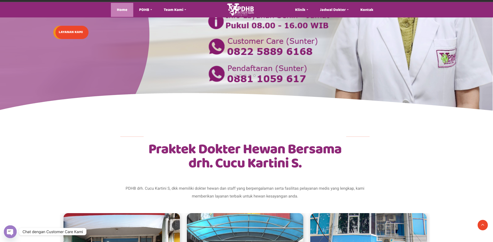
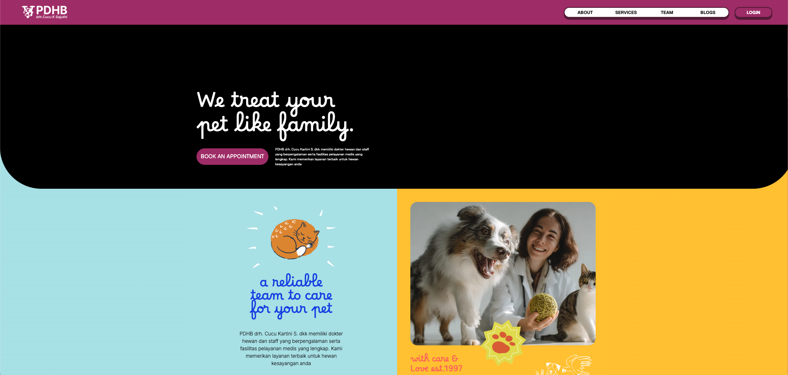

# Purwadhika Code Challenge 2 - Redesign Website PDHB (Dr. Cucu Kartini S.)

Proyek ini merupakan **Code Challenge 2** dari Purwadhika Digital Technology School. Tujuan dari proyek ini adalah **mendesain ulang** website company profile **PDHB (Praktek Dokter Hewan Bersama)** milik **drh. Cucu Kartini S.** yang bergerak di bidang klinik hewan.

Website lama: [pdhbvet.com](https://pdhbvet.com/)

---

## Perbandingan Website Lama vs Baru

### Website Lama


### Website Baru


| Aspek | Website Lama (pdhbvet.com) | Website Baru (Redesign) |
|---|---|---|
| **Desain** | Layout tradisional, warna ungu-putih, banyak elemen bertumpuk | Desain modern, clean, kombinasi warna bold (hitam, merah, kuning, biru muda) |
| **Typography** | Font standar, kurang hierarki visual | Font custom (Borel, Inter, Geist), hierarki visual yang jelas |
| **Navigasi** | Menu dropdown berlapis (submenu dalam submenu) | Navbar sederhana dan langsung: About, Services, Team, Blogs, Login |
| **Responsivitas** | Kurang optimal di mobile | Fully responsive dengan burger menu untuk mobile |
| **Hero Section** | Foto dokter dengan info kontak bertumpuk | Tagline besar "We treat your pet like family" dengan CTA yang jelas |
| **Konten Blog** | Tidak tersedia | Fitur blog lengkap dengan CRUD (admin), pencarian, dan filter kategori |
| **Autentikasi** | Tidak ada | Login admin dengan Supabase Auth + role-based access |
| **Performa** | Banyak asset tidak teroptimasi | Lazy loading, optimasi SEO (robots.txt), build modern dengan Vite |

---

## Fitur

- **Homepage** - Hero section, cerita perusahaan, USP (Unique Selling Point), overview layanan, testimonial
- **About Us** - Sejarah perusahaan, budaya kerja, galeri foto, profil tim
- **Services** - Daftar layanan klinik hewan, produk, dan testimonial layanan
- **Teams** - Profil dokter hewan dan staff dengan cerita tim
- **Blog (CRUD)** - Sistem blog lengkap:
  - Buat artikel baru (admin)
  - Edit artikel (admin)
  - Hapus artikel dengan seleksi multi-artikel (admin)
  - Pencarian dan filter berdasarkan kategori (judul, penulis, isi)
- **Autentikasi** - Login admin menggunakan Supabase Auth dengan JWT session
- **Role-Based Access** - Panel admin hanya muncul untuk user dengan role `admin`
- **Responsive Design** - Mendukung tampilan desktop dan mobile dengan burger menu
- **WhatsApp Contact** - Tombol kontak langsung ke WhatsApp
- **Google Maps** - Embed lokasi klinik

---

## Tech Stack

| Kategori | Teknologi |
|---|---|
| **Framework** | React 19 |
| **Bahasa** | TypeScript |
| **Build Tool** | Vite 7 |
| **Styling** | Tailwind CSS 4, tw-animate-css |
| **UI Components** | Radix UI, shadcn/ui, Lucide Icons |
| **Routing** | React Router 7 |
| **State Management** | Zustand |
| **Form & Validasi** | React Hook Form + Zod |
| **Autentikasi** | Supabase Auth |
| **Backend/API** | Backendless (REST API) |
| **HTTP Client** | Axios |
| **Linting** | ESLint + Prettier |
| **Deployment** | Vercel |

---

## Website Flowchart

```
Landing Page (/)
├── Navbar
│   ├── About (/about)
│   │   ├── Hero Section
│   │   ├── Cerita Perusahaan
│   │   ├── Budaya Kerja
│   │   ├── Galeri Foto
│   │   └── Profil Tim
│   │
│   ├── Services (/services)
│   │   ├── Hero Section
│   │   ├── Cerita Layanan
│   │   ├── Daftar Layanan (Cards)
│   │   ├── Produk
│   │   └── Testimonial
│   │
│   ├── Teams (/teams)
│   │   ├── Hero Section
│   │   ├── Cerita Tim
│   │   └── Profil Karyawan (Cards)
│   │
│   ├── Blogs (/blogs)
│   │   ├── Hero Section
│   │   ├── Search & Filter (judul/penulis/isi)
│   │   ├── Daftar Artikel (Blog Cards)
│   │   ├── Detail Artikel (/blogspage/:id)
│   │   │   └── Admin Panel (jika role admin)
│   │   │       └── Edit Artikel (/editblog/:id)
│   │   └── Admin Panel (jika role admin)
│   │       ├── Buat Artikel (/blogscreate)
│   │       └── Hapus Artikel (multi-select)
│   │
│   └── Login (/blogs_admin_login)
│       └── Supabase Auth (email + password)
│           ├── Sukses → redirect ke /blogs (dengan role)
│           └── Gagal → alert error
│
├── Homepage Sections
│   ├── Hero Section + CTA
│   ├── Story Section
│   ├── USP (Unique Selling Point)
│   ├── Overview Layanan
│   └── Testimonial
│
└── Footer
    ├── Google Maps (Lokasi Klinik)
    └── WhatsApp Contact
```